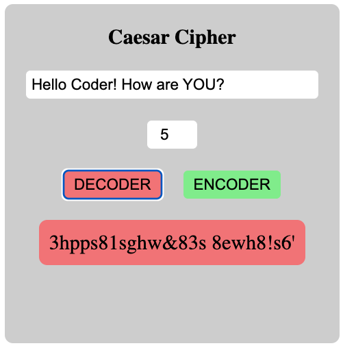
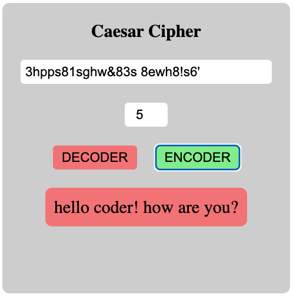

# caesar-cipher

# [Deployment]()

Caesar encryption is a simple symmetric encryption method based on monographic and monoalphabetic substitution. During encryption, each letter of the plaintext is mapped to a ciphertext letter. This mapping is obtained by cyclically shifting (rotating) the characters of an ordered alphabet to the right by a certain number; cyclically means that when shifting beyond Z, one continues counting again starting at A. The number of characters shifted forms the ciphertext letter. The number of characters shifted forms the key, which remains unchanged for the entire encryption.

Here is an example of a shift of three characters:

Key: 3

Plaintext alphabet: a b c d e f g h i j k l m n o p q r s t u v w x y z

Ciphertext alphabet: D E F G H I J K L M N O P Q R S T U V W X Y Z A B C

The word "test" with key 3 is "whvw"

The word "abc xyz" with key 3 is "def abc"

  

    
    
    
  

